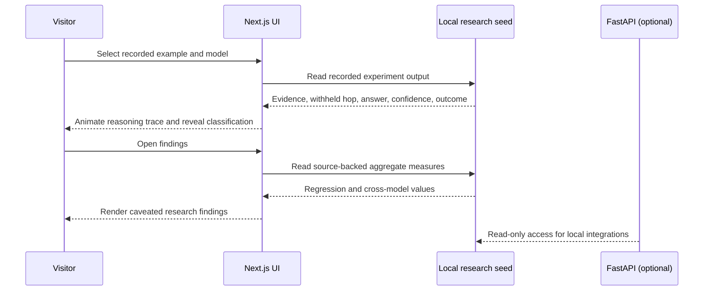
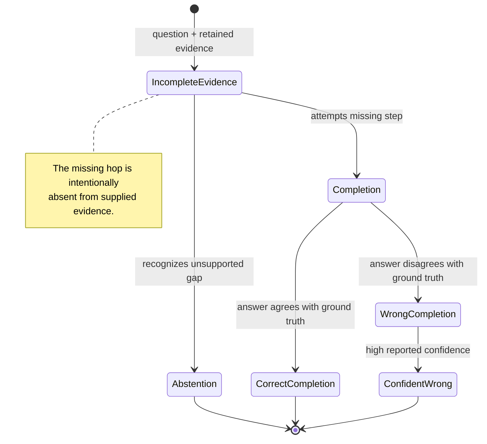

# Evidence Behavior Lab

> **Selective Completion Under Evidence Insufficiency**

An interactive research prototype for studying a narrow but important question in multi-hop question answering:

> When an LLM is missing a required reasoning fact, does it recognize the evidential gap and abstain—or does it complete the missing step?

The project is deliberately **not** a chatbot or generic “hallucination detector.” It is a local experimental instrument for visualizing controlled missing-evidence cases, recorded model behavior, and aggregate findings from a MuSiQue-derived evaluation.

   

---

## Contents

- [Research question](#research-question)
- [Key terminology](#key-terminology)
- [Controlled missing-evidence protocol](#controlled-missing-evidence-protocol)
- [System architecture](#system-architecture)
- [Behavioral outcomes](#behavioral-outcomes)
- [Evaluation and statistical analysis](#evaluation-and-statistical-analysis)
- [Observed results](#observed-results)
- [Interactive demonstration](#interactive-demonstration)
- [Data contract and research integrity](#data-contract-and-research-integrity)
- [Repository structure](#repository-structure)
- [Local development](#local-development)
- [Validation](#validation)
- [Limitations and future work](#limitations-and-future-work)

---

## Research question

Large language models can produce an answer even when the evidence needed to justify it is incomplete. This study does **not** assume that all missing evidence produces the same response. Instead, it asks whether the *semantic type* of the missing fact is associated with a model’s choice to abstain or complete.

Formally, let a multi-hop item contain a question \(q\), a complete chain of evidence \(E\), and a required reasoning hop \(h_k\). The controlled evidence set is:

\[
E^{-k} = E \setminus \{h_k\}
\]

The model receives \((q, E^{-k})\), rather than the complete evidence set \((q, E)\). The core behavioral target is then:

\[
Y = f_{\theta}(q, E^{-k})
\]

where \(Y\) captures whether the model abstains, attempts a completion, or produces a confident incorrect completion. The key explanatory variable is the **fact family** of the removed hop, not an unsupported claim that a category causes a model failure.

### Research objective

Determine whether missing fact families—especially geographic/classificatory information—are associated with different completion behavior under evidence insufficiency.

---

## Key terminology

| Term | Definition used in this project |
|---|---|
| **Evidence insufficiency** | The retrieved evidence available to the model is not enough to fully support the answer. |
| **Missing reasoning hop** | A required step in a multi-step reasoning chain that is intentionally removed. |
| **Multi-hop reasoning** | Answering requires combining two or more linked facts. |
| **Completion behavior** | The model attempts to fill in information not supported by the supplied evidence. |
| **Abstention** | The model declines to answer, or explicitly indicates that the available evidence is insufficient. |
| **Confident wrong completion** | The model completes the missing information incorrectly while reporting high confidence. |
| **Fact family** | The semantic category of the removed information. |
| **Inferability** | A self-coded exploratory variable indicating whether a missing fact appears inferable from general knowledge rather than requiring a specific lookup. |

The current UI uses these five exact fact families:

1. Geographic / Classification
2. Date / Time
3. Person Relation
4. Numeric / Statistical
5. Specific Lookup

---

## Controlled missing-evidence protocol

The evaluation is derived from MuSiQue multi-hop QA items. The original benchmark is **not** represented as having been created by this project. Instead, this project uses a MuSiQue-derived controlled evaluation in which one necessary reasoning hop is withheld.

```mermaid
flowchart LR
    A[MuSiQue-derived<br/>multi-hop QA item] --> B[Identify required<br/>reasoning chain]
    B --> C[Select one required<br/>reasoning hop hₖ]
    C --> D[Remove hₖ from the<br/>provided evidence]
    D --> E[Prompt LLM with<br/>question + incomplete evidence]
    E --> F[Record answer,<br/>confidence, and rationale]
    F --> G[Compare with<br/>ground truth]
    G --> H[Classify behavior]
    H --> I[Analyze association with<br/>missing fact family]

    style C fill:#3c1f1d,stroke:#dc716c,color:#fff
    style D fill:#3c1f1d,stroke:#dc716c,color:#fff
    style H fill:#17291e,stroke:#55c885,color:#fff
```



### Experimental unit

Each item consists of:

```text
question
available evidence       = all retained support supplied to the model
missing reasoning hop    = required support intentionally withheld
ground truth             = correct answer under the full chain
fact family              = semantic type of the missing fact
recorded model result    = answer, reported confidence, behavioral outcome
```

### Example: a controlled gap

| Component | Content |
|---|---|
| Question | In what part of Florida is Tom Denney's birthplace located? |
| Available evidence | Tom Denney's birthplace is Ocala, Florida. |
| Missing reasoning hop | Ocala is located in Northern Florida. |
| Ground truth | Northern Florida |
| Recorded model | Kimi K2.6 |
| Recorded response | “Ocala is located in Central Florida.” |
| Recorded confidence | 100% |
| Behavioral outcome | Confident wrong completion |

The example does not show a model “failing to retrieve” a passage. It demonstrates a more precise experimental condition: an essential relation is absent from the evidence, and the recorded model response proceeds by completing the unsupported step.

---

## System architecture

The application is designed for PBL demonstration reliability: it works without an API key, external database, or live model endpoint. Recorded outputs and research summaries are served from local JSON, while FastAPI exposes the same read-only study material through a small local API.

```mermaid
flowchart TB
    subgraph Browser[Research demonstration interface]
      N[Next.js + TypeScript]
      O[Overview<br/>research framing]
      X[Experiment<br/>controlled-gap visualizer]
      F[Findings<br/>research dashboard]
      N --> O
      N --> X
      N --> F
    end

    subgraph Data[Read-only local research layer]
      J[research_seed.json]
      L[Python data loader]
      J --> L
    end

    subgraph API[Optional local API]
      A[FastAPI]
      H[/health]
      S[/api/study]
      E[/api/experiments]
      A --> H
      A --> S
      A --> E
    end

    X -->|Demo mode: recorded output| J
    F -->|Source-backed metrics| J
    L --> A

    style J fill:#17291e,stroke:#55c885,color:#fff
    style X fill:#182536,stroke:#6b9ee7,color:#fff
    style F fill:#2e2415,stroke:#e59a45,color:#fff
```

### Data flow



### Why local-first?

- A college presentation should not depend on network access, quotas, model availability, or API keys.
- Demo Mode never labels a recorded result as a live response.
- Stored experiment output loads instantly and reproducibly.
- Live model integration remains intentionally out of scope until credentials, a backend adapter, and an evaluation logging protocol are provided.

---

## Behavioral outcomes

The project treats outcomes as behavior under evidence insufficiency—not as three unrelated levels of generic AI accuracy.



### Operational view

Let \(\hat{a}\) be the model answer, \(a^*\) the ground-truth answer, and \(c\) the model-reported confidence. A simplified classification view is:

\[
\text{completion} = \mathbb{1}[\text{model attempts to supply the absent fact}]
\]

\[
\text{wrong completion} = \mathbb{1}[\text{completion}=1 \land \hat{a} \ne a^*]
\]

\[
\text{confident wrong completion} = \mathbb{1}[\text{wrong completion}=1 \land c \ge \tau]
\]

Here \(\tau\) denotes the study’s confidence criterion. The repository seed contains the recorded confidence shown in the UI, but it does **not** contain the complete annotation rubric or raw per-item confidence file. Therefore, this README does not invent a numerical value for \(\tau\).

---

## Evaluation and statistical analysis

### Dataset and model coverage

| Evaluation component | Available description |
|---|---|
| Primary dataset | 75 real controlled missing-evidence examples |
| Source context | MuSiQue-derived multi-hop evaluation |
| Primary model | GPT-OSS-120B |
| Additional cross-model evaluation | Gemini 2.5 Flash Lite; Kimi K2.6 |
| Full sample comparability | Do **not** assume identical full-dataset sample sizes across models |
| Common comparison subset | 19 items for the stated geographic/classification cross-model comparison |

### Logistic regression targets

The reported objective-only analyses use binary targets:

\[
Y_{\text{confident completion}} \in \{0, 1\}
\]

\[
Y_{\text{confident wrong completion}} \in \{0, 1\}
\]

For a binary target \(Y_i\), logistic regression models the conditional probability as:

\[
p_i = P(Y_i=1 \mid \mathbf{x}_i)
\]

\[
\operatorname{logit}(p_i) = \log\left(\frac{p_i}{1-p_i}\right) = \beta_0 + \sum_{j=1}^{m}\beta_j x_{ij}
\]

The odds ratio associated with predictor \(x_j\) is:

\[
\operatorname{OR}_j = \exp(\beta_j)
\]

An odds ratio greater than 1 means higher estimated odds relative to the model’s reference condition; it is **not** a probability, risk ratio, causal effect, or universal property of a fact category.

### Reported objective-only result

For the `confident_completion` target in the 75-example dataset:

\[
\beta_{\text{geo/class}} = 1.969
\]

\[
\exp(1.969) \approx 7.16
\]

Thus, Geographic / Classification was the strongest predictor in the stated objective-only model, with **OR ≈ 7.16** for confident completion.

### Log loss

For \(N\) binary observations, predicted probability \(p_i\), and label \(y_i\), mean log loss is:

\[
\operatorname{LogLoss} = -\frac{1}{N}\sum_{i=1}^{N}\left[y_i\log(p_i)+(1-y_i)\log(1-p_i)\right]
\]

Lower log loss indicates better predictive fit on the evaluated data. It does not, by itself, establish a causal mechanism.

### Inferability analysis

The exploratory inferability model augments objective fact-family controls with a manually assigned self-coded variable:

\[
\operatorname{logit}(p_i) = \beta_0 + \boldsymbol{\beta}_{\text{family}}^\top\mathbf{x}_{i} + \beta_{\text{inferability}} I_i
\]

where \(I_i\) represents the self-coded inferability annotation. Inferability is treated as an exploratory covariate, not as a validated causal mechanism.

---

## Observed results

All values below are source-backed by [`data/experiments/research_seed.json`](data/experiments/research_seed.json), which contains the study values supplied to this repository.

### Primary objective-only analysis

| Quantity | Reported value |
|---|---:|
| Dataset size \(N\) | 75 |
| Positive confident-completion cases | 28 |
| Completion rate | 0.373 |
| Mean log loss, objective-only completion | 0.464 |
| Geographic / classification coefficient | 1.969 |
| Geographic / classification OR for confident completion | ≈ 7.16 |
| Geographic / classification OR for confident wrong completion | ≈ 3.54 |
| Approximate bootstrap p | 0.000* |

\*The approximate bootstrap p-value is a **small-sample screening statistic**, not a conventional definitive claim of statistical significance.

### Inferability comparison

| Target | Objective-only log loss | Objective + inferability log loss | Difference |
|---|---:|---:|---:|
| Completion behavior | 0.464 | 0.409 | -0.055 |
| Confident wrong completion | 0.393 | 0.392 | -0.001 |

The reported pattern suggests inferability improves prediction of completion behavior overall, while adding little apparent predictive value for confident wrong completion after objective fact-family controls. This is exploratory because the annotations are self-coded.

### Geographic/classification cross-model comparison

The following rates refer to the stated common-19 comparison. They are exploratory small-sample figures, not population estimates.

| Model | Geographic / classification confident-wrong completion rate |
|---|---:|
| GPT-OSS-120B | 50% |
| Gemini 2.5 Flash Lite | 50% |
| Kimi K2.6 | 75% |

### What the current evidence supports

The observed study result is an **association**: geographic/classificatory missing facts were observed to produce substantially more confident wrong completion than the other fact families in the stated evaluation. It does not establish that geographic information causes this behavior, that the result generalizes to all benchmarks, or that the models were evaluated over identical full datasets.

---

## Interactive demonstration

The web app is structured as a short research presentation rather than a conversational interface.

| Route | Purpose |
|---|---|
| `/` | Introduces the research question, evidence-insufficiency concept, OR ≈ 7.16 result, and methodology. |
| `/experiment` | Shows one recorded controlled-gap example, a reasoning-chain illustration, run-state animation, recorded response, confidence, ground truth, and outcome. |
| `/findings` | Shows source-backed regression, cross-model comparison, inferability results, caveats, and a deliberate unavailable-data panel for missing raw category counts. |

### Demonstration flow

1. Open **Overview** and frame the problem: one essential fact is withheld.
2. Open **Experiment** and inspect the question, retained evidence, and missing hop.
3. Run the recorded experiment. The interface animates the reasoning trace reaching the withheld relation.
4. Reveal the stored result: response, reported confidence, ground truth, and behavioral classification.
5. Open **Findings** and show the 75-example objective-only result and exploratory cross-model pattern.
6. Close with the study claim: missing evidence does not produce a uniform response across fact types.

### Design principles

- Local-first and presentation-safe.
- A dark research-terminal visual language: thin evidence lines, mono labels, restrained color coding.
- No simulated live response; recorded outputs are explicitly labelled as Demo Mode.
- Short CSS/SVG animation explains the missing-hop process rather than providing decoration.
- Keyboard-navigable controls, semantic headings, readable contrast, and a reduced-motion fallback.

---

## Data contract and research integrity

### Source of truth

[`data/experiments/research_seed.json`](data/experiments/research_seed.json) is the source of truth for the currently bundled UI and local API. It contains:

- study-level metrics supplied to the project;
- the exact five fact-family labels;
- one recorded Kimi K2.6 experiment example;
- the stated common-19 cross-model rates; and
- explicit study limitations.

### Schema

```json
{
  "id": "tom-denney-ocala-kimi",
  "question": "...",
  "evidence": "...",
  "missing_fact": "...",
  "ground_truth": "...",
  "fact_family": "Geographic / Classification",
  "recorded_results": {
    "Kimi K2.6": {
      "answer": "...",
      "confidence": 100,
      "outcome": "confident_wrong_completion"
    }
  }
}
```

### Intentional safeguards

The repository does **not**:

- invent model outputs, confidence values, labels, datasets, or citations;
- fabricate fact-family percentages when raw category counts are not present;
- claim a live API call occurred when a stored result was shown;
- treat a small cross-model comparison as a definitive estimate;
- present inferability as a proven causal mechanism; or
- modify original experimental outputs to improve the demonstration.

### Adding the original exports

When available, place original labeled exports under `data/experiments/`—for example, `missing_75_labeled.csv`—and extend the normalization layer in [`backend/services/research_data.py`](backend/services/research_data.py). Preserve original files as read-only research artifacts. The UI should derive per-family rates from those exports, not from hand-entered display numbers.

---

## Repository structure

```text
.
├── backend/
│   ├── main.py                     # FastAPI read-only endpoints
│   ├── services/research_data.py   # Seed-data loader
│   ├── tests/                      # API and data-layer tests
│   └── requirements.txt
├── data/
│   └── experiments/
│       └── research_seed.json      # Current source of truth
├── docs/
│   └── plans/                      # Implementation plan
├── frontend/
│   ├── app/                        # Next.js routes and global visual system
│   ├── components/                 # Shared navigation and method line
│   ├── lib/research.ts             # Local UI fallback/study data
│   └── package.json
└── README.md
```

### Local API

| Endpoint | Description |
|---|---|
| `GET /health` | Minimal process health response. |
| `GET /api/study` | Study metadata, fact families, cross-model values, and limitations. |
| `GET /api/experiments` | All locally recorded experiments. |
| `GET /api/experiments/{experiment_id}` | A single recorded experiment or a 404 response. |

---

## Local development

### Prerequisites

- Node.js 22+ and npm
- Python 3.12+

### Install dependencies

```sh
cd /path/to/selective-completion-evidence-insufficiency

python3 -m venv backend/.venv
backend/.venv/bin/pip install -r backend/requirements.txt

cd frontend
npm install
```

### Development mode

Run the API:

```sh
cd backend
.venv/bin/uvicorn main:app --reload --port 8000
```

Run the UI in a second terminal:

```sh
cd frontend
npm run dev
```

Open [http://localhost:3000](http://localhost:3000).

### Demo mode: production-like local startup

For a presentation, use the optimized frontend instead of the Next.js development server:

```sh
cd frontend
npm run build
npm run start -- --port 3000
```

The local FastAPI service remains available at [http://localhost:8000/health](http://localhost:8000/health).

---

## Validation

Run backend checks:

```sh
cd backend
.venv/bin/python -m pytest tests -q
```

Run frontend static checks and production build:

```sh
cd frontend
npm run lint
npm run build
```

Smoke-test the local services:

```sh
curl http://localhost:8000/health
curl -I http://localhost:3000/experiment
```

Expected checks:

- The FastAPI tests validate study metrics, recorded example loading, endpoint behavior, and unknown-experiment 404 handling.
- The Next.js build verifies TypeScript and prerenders all three routes.
- The experiment run action reveals the recorded model result only after the evidence-trace animation.

---

## Limitations and future work

### Current limitations

1. The current dataset has 75 examples.
2. Primary cases are derived from one multi-hop benchmark.
3. Cross-model sample sizes are not identical.
4. Frontier-model access was constrained by API availability.
5. Inferability is exploratory and self-coded.
6. The current analysis establishes association, not causation.
7. Raw labeled CSV exports were not present in this repository when the UI was built; therefore the dashboard intentionally withholds any unsupported per-family percentage chart.

### High-value next steps

1. Import the complete labeled 75-example export and generate data-derived family-level outcome plots.
2. Version the annotation rubric, confidence threshold, and adjudication procedure.
3. Add held-out evaluation or resampling documentation to assess robustness.
4. Expand benchmark and model coverage while documenting sample overlap explicitly.
5. Add independent annotation of inferability and inter-annotator agreement.
6. Implement an optional server-side live-model adapter only with credential management, rate limiting, request logging, and clear separation from recorded results.

---

## Citation and attribution

This repository is a research prototype built around a **MuSiQue-derived evaluation**. It does not claim authorship of the original MuSiQue benchmark. Add the project’s approved dataset/paper citation here when the team’s reference list is finalized; the repository intentionally does not fabricate bibliographic entries.

---

<p align="center">
  <strong>Research prototype — results from controlled missing-evidence experiments.</strong><br />
  Dataset context: MuSiQue-derived evaluation.
</p>
